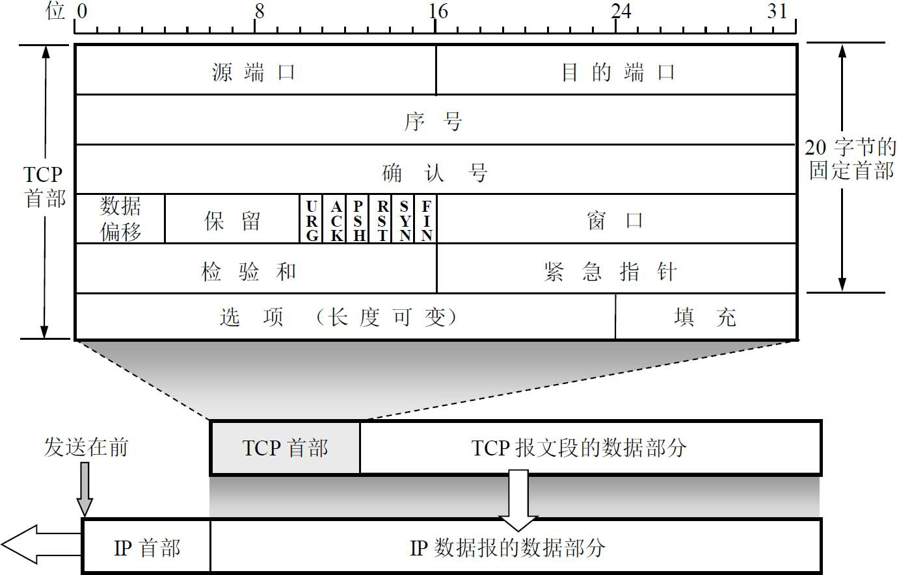
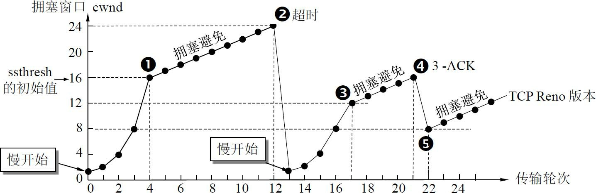
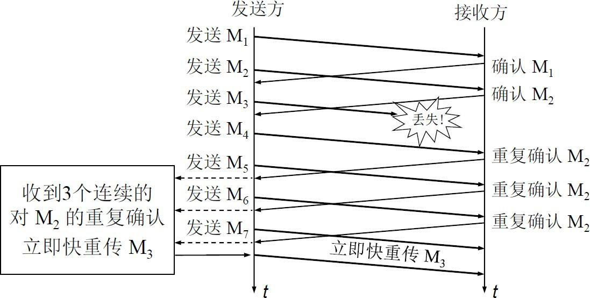
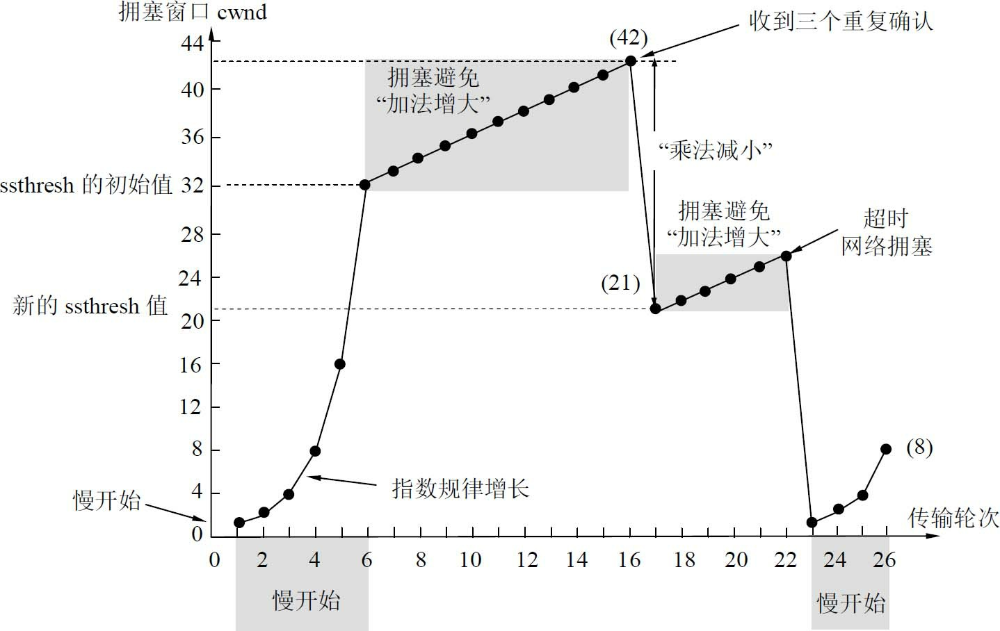
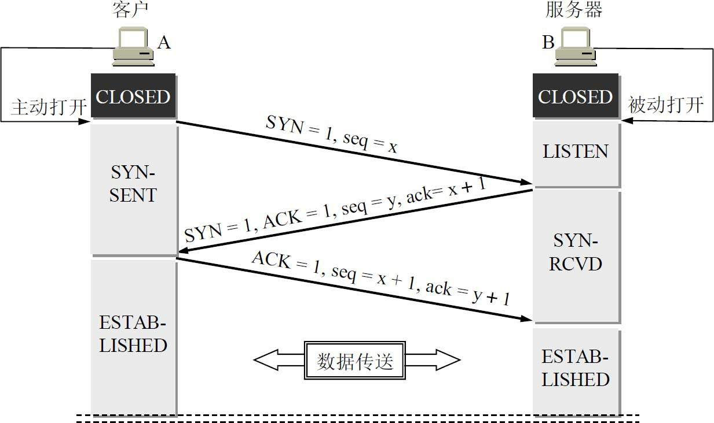
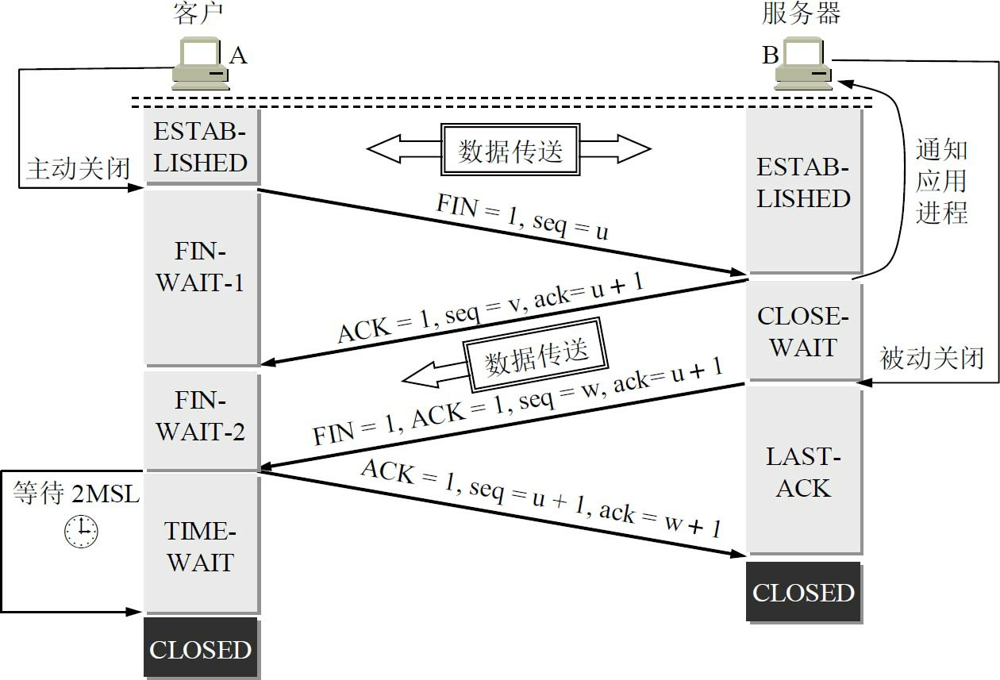

# #4 运输层 transport layer

重要概念：

1. 运输层为相互通信的应用进程提供逻辑通信。
2. 端口和套接字的意义。
3. 无连接的 UDP 的特点。
4. 面向连接的 TCP 的特点。
5. 在不可靠的网络上实现可靠传输的工作原理，停止等待协议和 ARQ 协议。
6. TCP 的滑动窗口、流量控制、拥塞控制、连接管理。

## 运输层协议概述

网络层为主机之间提供逻辑通信，而运输层为应用进程之间提供端到端的逻辑通信。

> “逻辑通信”的意思是“好像是这样通信，但事实上并非真的这样通信”。

运输层要对收到的报文进行差错检测。而网络层只检测首部不检测数据部分。

根据应用进程的不同需求，运输层有两种不同的运输协议：面向连接的 TCP 和无连接的 UDP。

PDU：根据所使用的协议是 TCP 或 UDP，协议数据单元分别称之为 TCP 报文段 或 UDP 用户数据报。

## 用户数据报协议 UDP

UDP 的主要特点：

1. 无连接。即发送数据之前不需要建立连接，当然发送数据结束时也没有连接可释放。因此减少了开销和发送数据之前的时延。
2. 尽最大努力交付。即不保证可靠性交付，因此主机不需要维持复杂的链接状态表。
3. 面向报文。对于发送方的应用层交下来的报文，UDP 只添加首部后就原封不动地交付给下面的 IP 层。对于接收时从 IP 层交上来地 UDP 用户数据报，去除首部后就原封不动地交付给上面的应用层中的应用程序。即，UDP 一次交付一个完整报文，因此应用程序必须选择合适大小的报文。
4. 无拥塞控制。因此网络中的拥塞不会使源主机地发送速率降低，很多实时应用要求源主机以恒定速率发送数据，并允许在网络发生拥塞时丢失一些数据，但不允许数据有太大延迟（比如实时视频会议）。UDP 正好适合这种。
5. 支持一对一、一对多、多对一和多对多的交互通信。
6. 首部开销小。

UDP 的首部格式：

​	用户数据报 UDP 有两个字段：首部字段和数据字段。首部分成4个字段，分别如下：

0. 伪首部：伪首部并不是 UDP 用户数据报真正的首部。只是在计算检验和时，临时添加在UDP用户数据报前面，得到一个临时的UDP用户数据报。检验和就是按照这个临时的UDP用户数据报来计算的。伪首部既不向下传送也不向上递交，而仅仅是为了计算检验和。
1. 源端口：源端口号，在需要对方回信时选用，不需要回信则可全用0。
2. 目的端口：目的端口号，在终点交付报文时必须使用。
3. 长度：UDP 用户数据报的长度，最小是是 8（仅有首部）。
4. 校验和：检测 UDP 用户数据报在传输中是否有错，是的话丢弃。

## 传输控制协议 TCP

TCP 的主要特点：

1. 面向连接。

2. 提供可靠交付的服务。通过 TCP 链接传送的数据，无差错、不丢失、不重复、按序到达。

3. 面向字节流。

4. 每条 TCP 连接只能是点对点的（一对一）。

   TCP 连接的端点不是主机，不是主机的 IP 地址，不是应用进程，也不是运输层的协议端口。

   TCP 连接的端点叫套接字或插口。套接字 = IP 地址: 端口号

   TCP 连接 = {套接字1, 套接字2} = {(IP 地址1: 端口号1), (IP 地址2: 端口号2)}

5. 提供全双工通信。

## 可靠传输的工作原理

TCP 发送的报文段是交给网络层传送的，但网络层只能提供尽最大努力交付，也就是说网络层及以下提供不可靠传输。因此 TCP 必须采取措施使两个运输层之间的通信变得可靠。

理想的传输条件满足两个特点：

1. 传输信道不产生差错。
2. 不管发送方以多快的速度发送数据，接收方总来得及处理收到的数据。

理想条件下不需要任何措施就能实现可靠传输。但实际网络都不具备上面的理想条件，因此就需要使用一些可靠传输协议。

1. 当出现差错时让发送方重传发生错误的数据。
2. 当接收方来不及处理收到的数据时及时通知发送方降低发送速率。

这样就能在不可靠的传输信道上实现可靠传输。下面从最简单的停止等待协议讲起。

### 停止等待协议

“停止等待”就是每发送完一个分组就停止发送，等待对方的确认。在收到确认后再发送下一个分组。

1. 无差错情况

2. 出现差错

   超时重传：A 只要超过了一段时间仍然没有收到确认，就认为刚才发送的分组丢失了，因而重传前面发送过的分组。这就叫做超时重传。要实现超时重传，就要在每发送完一个分组时设置一个超时计时器。如果在超时计时器到期之前收到了对方的确认，就撤销已设置的超时计时器。

3. 确认丢失和确认迟到

   确认丢失：

   A 在设定的超时重传时间内没有收到确认，并无法知道是自己发送的分组是出错还是丢失，或是 B 发送的确认丢失了。因此A在超时计时器到期后就要重传 M1。

   假定 B 又收到了重传的分组 M1。则 B 应该丢弃这个重复的分组M1，不向上层交付，然后向 A 发送确认（不能认为已经发送过（丢失了的）确认就不再发送，因为 A 之所以重传 M1 就是因为 A 没有收到对 M1 的确认）。

   确认迟到：

   传输过程中没有出现差错，但 B 对分组 M1 的确认虽未丢失，但是迟到了。于是 A 在计时器到期后因为还未收到迟到的对 M1 的确认而重发 M1。B 最终会收到两次 M1 并先后发出两次确认，而 A 最终也会收到重复的对 M1 的确认。A 对重复的确认的处理很简单：收下后就丢弃。B 同样要丢弃重复收到的发送 M1，并重传确认分组。

   归纳：不管发送的分组丢失了还是迟到了，A 这边一定时间没收到就自动重传，B 那边对于同一个信息，收到一次就确认一次。不管哪边，收到重复分组就丢弃该分组，但同时还要发送确认。

这种可靠传输协议常称为自动重传请求 ARQ（Automatic Repeat reQuest）。意思是重传的请求是自动进行的，接收方不需要请求发送方重传某个出错的特定分组。使用上述的确认和重传机制，我们就可以在不可靠的传输网络上实现可靠的通信。

停止等待协议的优点是简单，但缺点是信道利用率太低。为了提高传输效率，发送方可以不使用低效率的停止等待协议，而是采用流水线传输。

流水线传输就是发送方可连续发送多个分组，不必每发完一个分组就停顿下来等待对方的确认。这样可使信道上一直有数据不间断地在传送。显然，这种传输方式可以获得很高的信道利用率。当使用流水线传输时，就要使用下面介绍的连续 ARQ 协议和滑动窗口协议。

### 连续 ARQ 协议

连续 ARQ 协议可提高信道利用率。发送方维持一个发送窗口，凡位于发送窗口内的分组都可连续发送出去，而不需要等待对方的确认。接收方一般采用累积确认，对按序到达的最后一个分组发送确认，表明到这个分组为止的所有分组都已正确收到了。

如果发送方发送了前5个分组，而中间的第3个分组丢失了。这时接收方只能对前两个分组发出确认。发送方无法知道后面三个分组的下落，而只好把后面的三个分组都再重传一次。这就叫做 Go-back-N（回退N），表示需要再退回来重传已发送过的N个分组。因此当通信线路质量不好时，连续 ARQ 协议会带来负面的影响。

在深入讨论 TCP 的可靠传输问题之前，必须先了解 TCP 的报文段首部的格式。

## TCP 报文段的首部格式

TCP 虽然是面向字节流的，但 TCP 传送的数据单元却是报文段。一个 TCP 报文段分为首部和数据两部分，而 TCP 的全部功能都体现在它首部中各字段的作用。因此，只有弄清 TCP 首部各字段的作用才能掌握 TCP 的工作原理。首部固定部分各字段如下：

1. 源端口 目的端口

2. 序号（seq）：首部中的序号字段值指的是本报文段所发送的数据的第一个字节的序号。

3. 确认号（ack）

   TCP 首部中的确认号是期望收到对方下一个报文段的第一个数据字节的序号。应记住：若确认号 ＝ N，则表明：到序号 N–1 为止的所有数据都已正确收到。

4. 数据偏移

   指出 TCP 报文段的数据起始处距离 TCP 报文段的起始处有多远。这个字段实际上是指出 TCP 报文段的首部长度。由于首部中还有长度不确定的选项字段，因此数据偏移字段是必要的。

5. 保留：保留为今后使用，但目前应置为 0。

6. 6 个控制位

   1. 紧急 URG（URGent）：告诉系统此报文段中有紧急数据，应尽快传送（相当于高优先级的数据），而不要按原来的排队顺序来传送。
   2. 确认 ACK（ACKnowledgment）：TCP 规定，在连接建立后所有传送的报文段都必须把 ACK 置 1。
   3. 推送 PSH（PuSH）：尽快地（即“推送”向前）交付接收应用进程，而不再等到整个缓存都填满了后再向上交付。注意将推动 PSH 与紧急 URG 区分，推送并不改变相对顺序，只是希望立即得到对方响应。推送操作很少使用。
   4. 复位 RST（ReSeT）：表明 TCP 连接中出现严重差错（比如主机崩溃），必须释放连接，然后再重新建立运输连接。
   5. 同步 SYN（SYNchronization）：在连接建立时用来同步序号。当 SYN＝1 而 ACK＝0 时，表明这是一个连接请求报文段。对方若同意建立连接，则应在响应的报文段中使 SYN＝1 和 ACK＝1。因此，SYN 置为 1 就表示这是一个连接请求或连接接受报文。
   6. 终止 FIN（FINis，意思是“完”、“终”）：用来释放一个连接。表明此报文段的发送方的数据已发送完毕，并要求释放运输连接。

7. 窗口：窗口字段明确指出了现在允许对方发送的数据量。窗口值经常在动态变化着。

8. 检验和

9. 紧急指针

10. 选项

## TCP 可靠传输的实现

### 以字节为单位的滑动窗口

TCP 使用滑动窗口机制。发送窗口里面的序号表示允许发送的序号。发送窗口后沿的后面部分表示已发送且已收到了确认，而发送窗口前沿的前面部分表示不允许发送。发送窗口后沿的变化情况有两种可能，即不动（没有收到新的确认）和前移（收到了新的确认）。发送窗口前沿通常是不断向前移动的。

### 超时重传时间的选择

TCP 的发送方在规定的时间内没有收到确认就要重传已发送的报文段。这种重传的概念很简单，但重传时间的选择却是 TCP 最复杂的问题之一。

由于 TCP 的下层是互联网环境，互联网由多种异构网络互连组成，异构决定了互联网环境的复杂性，发送的报文段可能只经过一个高速率的局域网，也可能经过多个低速率的网络，并且每个IP数据报所选择的路由还可能不同。如果把超时重传时间设置得太短，就会引起很多报文段的不必要的重传，使网络负荷增大。如果把超时重传时间设置得过长，则又使网络的空闲时间增大，降低了传输效率。

那么，运输层的超时计时器的超时重传时间究竟应设置为多大呢？TCP 采用了一种自适应算法，它记录一个报文段发出的时间，以及收到相应的确认的时间。这两个时间之差就是报文段的往返时间 RTT。通过复杂的修正算法，可以使超时重传时间的估测和计算更加合理。

## TCP 的流量控制

流量控制就是让发送方的发送速率不要太快，要让接收方来得及接收。利用滑动窗口机制可以很方便地在TCP连接上实现对发送方的流量控制。

## TCP 的拥塞控制

在某段时间，若对网络中某一资源的需求超过了该资源所能提供的可用部分，就会出现拥塞。拥塞控制就是防止过多的数据注入到网络中，这样可以使网络中的路由器或链路不致过载。

流量控制是一个端到端的问题，是接收端抑制发送端发送数据的速率，以便使接收端来得及接收。而拥塞控制是一个全局性的过程，涉及到所有的主机、所有的路由器，以及与降低网络传输性能有关的所有因素。

为了进行拥塞控制，TCP 的发送方要维持一个拥塞窗口 cwnd 的状态变量。拥塞窗口的大小取决于网络的拥塞程度，并且动态地在变化。发送方让自己的发送窗口取为拥塞窗口和接收方的接收窗口中较小的一个。

TCP 的拥塞控制采用了四种算法，即慢开始、拥塞避免、快重传和快恢复。在网络层，也可以使路由器采用适当的分组丢弃策略（如主动队列管理 AQM），以减少网络拥塞的发生。

### 慢开始和拥塞避免

也叫做基于窗口的拥塞控制。为此，发送方维持一个叫做拥塞窗口 cwnd（congestion window）的状态变量。拥塞窗口的大小取决于网络的拥塞程度，并且动态地在变化。发送方让自己的发送窗口等于拥塞窗口。

发送方控制拥塞窗口的原则是：只要网络没有出现拥塞，拥塞窗口就可以再增大一些，以便把更多的分组发送出去，这样就可以提高网络的利用率。但只要网络出现拥塞或有可能出现拥塞，就必须把拥塞窗口减小一些，以减少注入到网络中的分组数，以便缓解网络出现的拥塞。

发送方又是如何知道网络发生了拥塞呢？我们知道，当网络发生拥塞时，路由器就要丢弃分组。因此只要发送方没有按时收到应当到达的确认报文，也就是说，只要出现了超时，就可以猜想网络可能出现了拥塞。现在通信线路的传输质量一般都很好，因传输出差错而丢弃分组的概率是很小的（远小于 1％）。因此，判断网络拥塞的依据就是出现了超时。

下面将讨论拥塞窗口 cwnd 的大小是怎样变化的。我们从“慢开始算法”讲起。

慢开始算法的思路：当主机开始发送数据时，由于不清楚网络的负荷情况，所以如果立即把大量数据字节注入到网络，有可能引起网络发生拥塞。经验证明，较好的方法是先探测一下，即由小到大逐渐增大发送窗口，也就是说，由小到大逐渐增大拥塞窗口数值。

拥塞避免算法的思路：让拥塞窗口 cwnd 缓慢地增大，即每经过一个往返时间 RTT 就把发送方的拥塞窗口 cwnd 加 1，而不是像慢开始阶段那样加倍增长。这表明在拥塞避免阶段，拥塞窗口 cwnd 按线性规律缓慢增长，比慢开始算法的拥塞窗口增长速率缓慢得多。

图为 TCP 拥塞窗口 cwnd 在拥塞控制时的变化情况。

### 快重传

背景：有时，只有个别报文段会在网络中丢失，但实际上网络并未发生拥塞。如果发送方迟迟收不到确认，就会产生超时，然后误认为网络发生了拥塞，导致发送方错误地启动慢开始，把拥塞窗口 cwnd 又设置为1，因而降低了传输效率。

采用快重传算法可以让发送方尽早知道发生了个别报文段的丢失。当接收方收到失序的报文段时立即发出对已收到的报文段的重复确认。例如，现在收到了 M1、M2、M4，但是 M3 丢失了，于是接收方收到（失序的报文段）M4 时重传对（已收到的报文段）M2 的确认（而不是确认 M4），收到 M5、M6 时同理也重传对 M2 的确认而不确认 M5、M6。接收方从首次收到 M2 到收到 M6 时，一共进行了 4 次对 M2 的重复确认，其中后 3 次确认是重复确认。

快重传算法规定，发送方只要连续收到 3 个重复确认，就知道接收方确实没有收到报文段 M3，应当立即进行重传（即“快重传”），这样就不会出现超时，发送方也不就会误认为出现了网络拥塞。使用快重传可以使整个网络的吞吐量提高约 20％。

### 快恢复

如果发送方知道现在只是丢失了个别报文段，没有出现拥塞。那么就不启动慢开始，而是执行快恢复算法。此时令发送方调整门限值 ssthresh＝cwnd/2，同时设置拥塞窗口 cwnd＝ssthresh，然后执行线性增长的拥塞避免算法（而非指数增长的慢开始算法）。

## TCP 的运输连接管理

运输连接有三个阶段，即：连接建立、数据传送和连接释放。运输连接的管理就是使运输连接的建立和释放都能正常地进行。

在 TCP 连接建立过程中要解决以下三个问题：

1. 要使每一方能够确知对方的存在。
2. 要允许双方协商一些参数（如最大窗口值、是否使用窗口扩大选项和时间戳选项以及服务质量等）。
3. 能够对运输实体资源（如缓存大小、连接表中的项目等）进行分配。

TCP 连接的建立采用 C/S 方式。主动发起连接建立的应用进程叫做客户（client），被动等待连接建立的应用进程叫做服务器（server）。

### 握手

TCP 建立连接的过程叫做握手，握手需要在客户和服务器之间交换三个 TCP 报文段。

1. A 打算建立 TCP 连接时，向 B 发出连接请求报文段，这时首部中的同步位 SYN＝1，同时选择一个初始序号 seq＝x。TCP 规定，SYN＝1 的报文段不能携带数据，但要消耗掉一个序号。这时，TCP 客户进程进入 SYN-SENT（同步已发送）状态。
2. B 收到连接请求报文段后，如果同意建立连接，则向 A 发送确认。在确认报文段中应把 SYN 位和 ACK 位都置 1，确认号是 ack＝x＋1，同时也为自己选择一个初始序号 seq＝y。请注意，这个报文段也不能携带数据，但同样要消耗掉一个序号。这时 TCP 服务器进程进入 SYN-RCVD（同步收到）状态。
3. TCP 客户进程收到 B 的确认后，还要向 B 给出确认。确认报文段的 ACK 置 1，确认号 ack＝y＋1，而自己的序号 seq＝x＋1。TCP 的标准规定，ACK 报文段可以携带数据。但如果不携带数据则不消耗序号，在这种情况下，下一个数据报文段的序号仍是 seq＝x＋1。这时，TCP 连接已经建立，A 进入 ESTABLISHED（已建立连接）状态。当 B 收到 A 的确认后，也进入 ESTABLISHED 状态。

总结：TCP 的连接建立采用三报文握手机制。服务器要确认客户的连接请求，然后客户要对服务器的确认进行确认。

- 问：为什么是三次握手而不是四次握手？

上面给出的连接建立过程叫做三报文握手。请注意，B 发送给 A 的报文段，也可拆成两个报文段。可以先发送一个确认报文段（ACK＝1，ack＝x＋1），然后再发送一个同步报文段（SYN＝1，seq＝y）。这样的过程就变成了四报文握手，但效果是一样的。

- 问：为什么是三次握手而不是两次握手？即，为什么 A 最后还要发送一次确认？

这主要是为了防止已失效的连接请求报文段突然又传送到了 B，因而产生错误。

所谓“已失效的连接请求报文段”是这样产生的。考虑一种正常情况，A 发出连接请求，但因连接请求报文丢失而未收到确认。于是 A 再重传一次连接请求。后来收到了确认，建立了连接。数据传输完毕后，就释放了连接。A 共发送了两个连接请求报文段，其中第一个丢失，第二个到达了 B，没有“已失效的连接请求报文段”。

现假定出现一种异常情况，即 A 发出的第一个连接请求报文段并没有丢失，而是在某些网络结点长时间滞留了，以致延误到连接释放以后的某个时间才到达 B。本来这是一个早已失效的报文段。但 B 收到此失效的连接请求报文段后，就误认为是 A 又发出一次新的连接请求。于是就向 A 发出确认报文段，同意建立连接。假定不采用报文握手，那么只要 B 发出确认，新的连接就建立了。由于现在 A 并没有发出建立连接的请求，因此不会理睬 B 的确认，也不会向 B 发送数据。但B却以为新的运输连接已经建立了，并一直等待 A 发来数据。B 的许多资源就这样白白浪费了。

采用三报文握手的办法，可以防止上述现象的发生。例如在刚才的异常情况下，A 不会向 B 的确认发出确认。B 由于收不到确认，就知道 A 并没有要求建立连接。

### 挥手

TCP 连接释放过程比较复杂。

1. 数据传输结束后，通信的双方都可释放连接。现在 A 和 B 都处于 ESTABLISHED（已建立连接）状态。A 先发出连接释放报文段，并停止发送数据，主动关闭 TCP 连接。A 把连接释放报文段首部的终止控制位 FIN 置 1，其序号 seq＝u，它等于前面已传送过的数据的最后一个字节的序号加 1。这时 A 进入 FIN-WAIT-1（终止等待1）状态，等待 B 的确认。

2. B 收到连接释放报文段后即发出确认，确认号是 ack＝u＋1，而这个报文段自己的序号是 v，等于 B 前面已传送过的数据的最后一个字节的序号加 1。然后 B 就进入 CLOSE-WAIT（关闭等待）状态。TCP 服务器进程这时应通知高层应用进程，因而从 A 到 B 这个方向的连接就释放了，这时的 TCP 连接处于半关闭（half-close）状态，即 A 已经没有数据要发送了，但 B 若发送数据，A 仍要接收。也就是说，从 B 到 A 这个方向的连接并未关闭，这个状态可能会持续一段时间。

（A 收到来自 B 的确认后，就进入 FIN-WAIT-2（终止等待2）状态，等待 B 发出的连接释放报文段。）

3. 若 B 已经没有要向 A 发送的数据了，其应用进程就通知 TCP 释放连接。这时 B 发出的连接释放报文段必须使 FIN＝1。现假定 B 的序号为 w（在半关闭状态B可能又发送了一些数据）。B 还必须重复上次已发送过的确认号 ack＝u＋1。这时 B 就进入 LAST-ACK（最后确认）状态，等待 A 的确认。
4. A 在收到 B 的连接释放报文段后，必须对此发出确认。在确认报文段中把 ACK 置 1，确认号 ack＝w＋1，而自己的序号是 seq＝u＋1（根据 TCP 标准，前面发送过的 FIN 报文段要消耗一个序号）。然后进入到 TIME-WAIT（时间等待）状态。请注意，现在 TCP 连接还没有释放掉。必须经过时间等待计时器（TIME-WAIT timer）设置的时间 2MSL 后，A 才进入到 CLOSED 状态。当 A 撤销相应的传输控制块 TCB 后，就结束了这次的 TCP 连接。

总结：TCP 的连接释放采用四报文握手机制。任何一方都可以在数据传送结束后发出连接释放的通知，待对方确认后就进入半关闭状态。当另一方也没有数据再发送时，则发送连接释放通知，对方确认后就完全关闭了 TCP 连接。